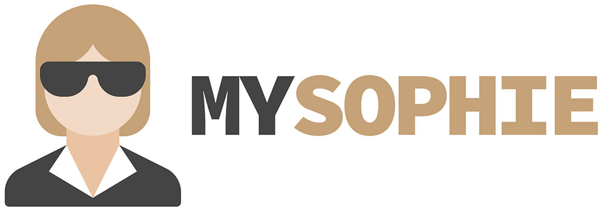

  
   
   
  
  
  
  

# mysophie
**mysophie is a tool that handles static assets versioning and can be plugged into any building process. It's stateless, allows very aggressive cache settings and only runs once per production build.**

### What is the problem?
Let's say we change our major api and then update the corresponding script file of our website. After developing, testing, pushing to dev and testing again we are happy with everything and decide to push to our production environment. Changes are pushed you test it again just for selfconfidence. Everything works great you are happy and go home.

The next day comes, you go to work and open your email box and end up with a lot of user reports that your site is broken. You evaluate the problem and find that some of your users had the old script version in their browser cache. Now their old code is calling a api function that doesn't exist any more.

We would now have to explain our users how to reset their cache (and of course every browser has different instructions) and hope that everything goes well.

### What does mysophie against it?
mysophie renames all your links to script or stylesheet files to a unique name and updates your html file corresponding. The name relies only on your code inside the file - so any content change will lead to a new unique filename and hence force users to load the new version automatically.

### Advantages
- no performance decrease for either client or server because all work is done during building a new production release
- aggressive caching - both parties safe bandwith because we can set the caching time (theoretically) to infinite. Client only needs to load new versions when the are available 
- stateless - doesn't rely on incrementing numbers (e.g. from the version control system, continuous integration service or just a simple file containing a counter)
- local development can be done without running the tool
- available as a CLI
- no config files - very simple cl arguments
- most importantly: **it works**

### How it works?
mysophie searches through html files for a specific pattern that indicates the need to handle a static asset. This pattern is a custom html data attribute `data-mysophie=""`. If mysophie finds this pattern it knows that immediately afterwards there must be ether a `href` (in `<link>` tags for stylesheets) or a `src` (in `<script>` tasg for js files).

mysophie will now search this file in it's list of assets and replace the link to an updated version with the following pattern: `<filename>-<sha-hash>.<extension>`. Original filename and extension get copied into the new link for better readability and easier debugging. The `<sha-hash>` will be replaced with the first 10 characters of the file's SHA256 hash (as hex representation). So any content change will lead to a new filename in the production build and hence force the user's browser to reload that asset.

After a file is finished mysophie also removes all occurrenceses of the search pattern `data-mysophie=""`.

### A tool for your production building process - not for local development
mysophie is intended as one of the last tools in the building-process of a production release and not for local development! Every web developer knows how to force a cache-refresh in his browser (e.g. Chrome=Ctrl+F5). HOWEVER mysophie is aware of local development and hence structured to not break anything without it's presence (that's the reason we choose `data-mysophie=""` as search pattern - the browser will just ignore it)

**Sample build process**

- copy html files to `/prod/` directory (this folder gets copied into production)
- run any preprocessor on your stylesheet files (e.g. compass for SASS) and copy them into `/prod/css/`
- run any transpiler on your script code (e.g. typescript) and copy them into `/prod/js/`
- run any js optimizing tools (e.g. closure-compiler) on your js files in `/prod/js/` and override them with the optimized versions
- run mysophie with `--root /prod/`. This will scan all html files found in `/prod/` and all it's sub directories. Afterwards performs everything as explained in [How it works?](#how-it-works) and renames js and css files.
- push to production

### CL arguments
Argument | Short | Description
-------- | ----- | -----------
`--root` | `-r` | The website's root folder Example: `mysophie -r /prod/`
`--html` | `-h` | Regular expression which is used as a search pattern for html files. Default value matches all files with `.html` extension. This argument is allowed multiple times. Example: `sophie --h .+\.html --h .+\.gotmpl`
`--static` | `-s` | Specifies one static resource directory. First argument after `--static` is the input folder relative to the root directory. Second argument is a regex expression which is used for file matching. This argument is allowed multiple times. Example: `sophie -s /css/ .+\.css -s /js/ .+\.js`

### License
MIT License

Copyright (c) 2017 Florian Harwöck

Permission is hereby granted, free of charge, to any person obtaining a copy
of this software and associated documentation files (the "Software"), to deal
in the Software without restriction, including without limitation the rights
to use, copy, modify, merge, publish, distribute, sublicense, and/or sell
copies of the Software, and to permit persons to whom the Software is
furnished to do so, subject to the following conditions:

The above copyright notice and this permission notice shall be included in all
copies or substantial portions of the Software.

THE SOFTWARE IS PROVIDED "AS IS", WITHOUT WARRANTY OF ANY KIND, EXPRESS OR
IMPLIED, INCLUDING BUT NOT LIMITED TO THE WARRANTIES OF MERCHANTABILITY,
FITNESS FOR A PARTICULAR PURPOSE AND NONINFRINGEMENT. IN NO EVENT SHALL THE
AUTHORS OR COPYRIGHT HOLDERS BE LIABLE FOR ANY CLAIM, DAMAGES OR OTHER
LIABILITY, WHETHER IN AN ACTION OF CONTRACT, TORT OR OTHERWISE, ARISING FROM,
OUT OF OR IN CONNECTION WITH THE SOFTWARE OR THE USE OR OTHER DEALINGS IN THE
SOFTWARE.
